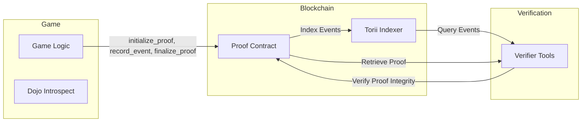
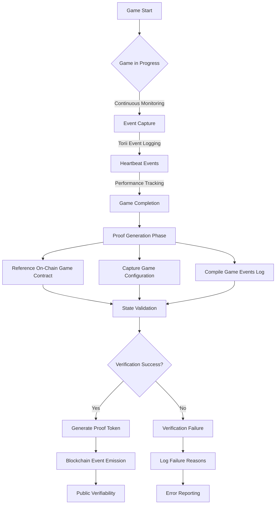

# Proof of Speed 

**Version:** 0.1 

## Introduction
Speedrunning—achieving record times in gaming—is a core part of many gaming communities, but verifying these claims can be challenging. “Proof of Speed” aims to bring trustless verification to speed records on Starknet. By providing cryptographic proofs anchored to on-chain data, we ensure that a given record was achieved under specific conditions and game logic, without interfering with player performance or relying solely on trust.

This approach draws inspiration from Autonomous Worlds (AW), particularly the concepts of local loops and meta game loops, and integrates with tools like Dojo (for game logic) and Torii (for event indexing).


## Key Features and Approach

**Specific Focus on Game Proofs:**  
We focus on verifying the authenticity of the game environment rather than proving the human authenticity of the player. We ensure that the record took place on a known, verified version of the game under the claimed configuration. Although player authenticity remains difficult, verifying the game environment is achievable.


**Utilizing the Introspect Trait and Torii Events:**  
- **Dojo Introspect:** Use Dojo’s `Introspect` to query and confirm game state and logic.  
- **Torii Events:** Torii indexes on-chain events, enabling us to reconstruct the gameplay timeline by querying events and their associated block numbers.

**Post-Completion Proof Generation:**  
Generate proofs after the game’s completion to avoid performance impact on the player and to ensure the entire event log is available for verification.

**Event-Based Decision Making & Timing Anchors:**  
We can rely on game events as our source of truth. By introducing “heartbeat” events or referencing block numbers, we anchor event sequences to on-chain data. Although not perfect real-world timing, it establishes a reliable relative timeline. Future solutions like AppChains or proof-of-history methods may improve this further.

**Real Time Data For Analytics**:
We can leverage Torii's gRPC calls to create alerts for specific actions. This will allow player's behaviour analysis

## Components of the Proof

1. **On-Chain Game Contract:**
By referencing the on-chain game contract address, we ensure that the run took place in a known, deployed game environment. Since the contract code is associated with a specific class hash on Starknet, this provides a baseline assurance that the gameplay logic was not altered during the run.
   
2. **Game Configuration:**  
   Hashing the configuration (e.g., difficulty, map settings) prevents post-run tampering with claimed conditions.

3. **Game Events:**  
   All relevant in-game events (start, checkpoints, completion) are recorded on-chain. Torii’s indexing allows querying by block number to reconstruct the event order.

4. **Real-World Integration via Torii:**  
   While Torii timestamps may not match exact real-world timing, they help establish the order and approximate timing of events based on when blocks were processed.

5. **Real Time Alerts via Torii:**
gRPC calls can provide real time alerts on specific events. These events can be used to analyse players behaviour, while this alone won't be enough to determine if the player is playing fairly or not, it can contribute to identify and improve weak points in the game.
 

## Integration with Dojo, Torii and AW

- **Dojo (ECS Framework):**  Dojo’s Entity-Component-System (ECS) model structures game logic into models and components. Each model in Dojo automatically implements the Introspect trait, which describes the model’s data layout and type information. This standardized introspection:

	• Allows Dojo’s world database engine and Torii to index and query model data efficiently.
	• Ensures we can verify that recorded events align with valid state transitions defined by the game’s data model.
	• Provides clear, introspectable schemas for both built-in and custom user-defined types. Developers can derive Introspect or manually implement it, ensuring that all fields—whether basic Cairo types or complex structs—are well-defined and traceable.

	By leveraging Introspect, the proof-of-speed mechanism can confirm that each event corresponds to a legitimate and expected change in the game state. This prevents fabricated or out-of-spec game data from being recorded. Over time, as models evolve, using Introspect (or IntrospectPacked for fixed layouts) helps maintain a verifiable mapping between the game’s internal logic and the proofs generated.

- **Torii (Event Indexing and real time alerts):**  Torii is an automatic indexer and client for Dojo worlds, designed for high performance and scalability. By indexing your game’s on-chain events and state changes, Torii provides a typed GraphQL interface and a high-performance gRPC API for real time data.

  **How It Works:**
	• **Automatic Indexing:** Torii uses world introspection to bootstrap directly from a deployed world contract, indexing components, systems, and events without extensive manual configuration.

	• **Flexible Queries:** Once Torii is running (e.g., `torii --world <World Address>`), developers or external tools can query its GraphQL endpoint for structured, typed queries or use the gRPC API for high-performance real-time data streaming.

	• Local or Persistent Storage: Torii uses an SQLite database for storing indexed data. It can run in-memory for quick development and testing, or persistently for production environments.
    
- **AW (Autonomous Worlds):**  Concepts from AW encourage local-first loops and verifiable game states. Although we focus on proof-of-environment now, we remain compatible with AW primitives that may later enhance timing or identity verification.

### Integration with Proof of Speed

After the Proof of Speed contract finalizes a run, all relevant game events (e.g., level start, checkpoints, completion) will have been indexed by Torii. Anyone can connect to Torii’s GraphQL or gRPC endpoints to:

• Retrieve event logs,
• Filter events by block number or specific entities,
• Correlate these events with the final proof hash provided by the Proof of Speed contract.

By leveraging Torii’s indexing capabilities, the Proof of Speed system ensures that the timeline and conditions under which a run occurred are easily accessible and verifiable by any interested party. This lays a foundation for building external verification tools, dashboards, or community leaderboards that depend on timely, accurate event data.



### Integration Overview

The Proof of Speed system comprises three key domains: the game logic (Game), the blockchain infrastructure, and verification tools. The following diagram illustrates the high-level interactions between these components:


This modular architecture ensures that each component handles a specific responsibility:
	•	Game Logic: Uses Dojo’s Introspect to emit events during gameplay.
	•	Blockchain: Stores game events in the Proof Contract and indexes them via Torii for retrieval.
	•	Verification Tools: Query Torii for event logs and validate the proof hash to ensure integrity.

The existing diagram under Example Flow would then dive deeper into how the proof is generated and finalized step by step. This keeps the narrative logical and avoids redundancy while showcasing both the architecture and the process.


### Limitations and Future Considerations
- **Player Authenticity:**  
  We cannot guarantee a human player. Account abstraction, the nature of the Starknet blockchain and the presence of identites (like DAOs) that should be able to play the game as anybody else mean an account might be automated or another smart contract. Future off-chain attestation or identity frameworks could address this.

- **Timing Precision:**  
  We rely on block numbers and Torii’s indexing for relative timing. Future solutions (AppChains, PoH-like methods) could provide finer-grained timing.

- **Scaling with AppChains:**  
  As games migrate to AppChains for faster throughput, we can adapt our proofs to these new environments, maintaining integrity even as event density and transaction frequency grow.

## Example Flow

1. **Initialization:**  
   The game calls `initialize_proof` to record the contract_address and config_hash.

2. **Event Logging:**  
   As the player progresses, `record_event` is called for key milestones. Events are stored on-chain and indexed by Torii.

3. **Finalization:**  
   Upon completion, `finalize_proof` aggregates all events and hashes them together with the code and configuration. This final proof can be shared for verification.





## Example Code Snippets

### Models and Events
```cairo

// Example events representing player actions in the game.
#[derive(Copy, Drop, Serde)]
#[dojo::event]
pub struct Spawned {
    #[key]
    pub player: ContractAddress,
    pub position: Position,
}

#[derive(Copy, Drop, Serde)]
#[dojo::event]
pub struct Moved {
    #[key]
    pub player: ContractAddress,
    pub direction: Direction,
}

#[derive(Copy, Drop, Serde)]
#[dojo::event]
pub struct WinCondition {
    #[key]
    pub player: ContractAddress,
    pub position: Position,
}

// Placeholder structs for Position and Direction.
#[derive(Copy, Drop, Serde, Debug)]
pub struct Position {
    pub x: i32,
    pub y: i32,
}

#[derive(Copy, Drop, Serde, Debug)]
pub enum Direction {
    Up,
    Down,
    Left,
    Right,
}
```


### Storage Schema
```cairo
#[storage]
struct Storage {
    config_hash: felt252,                    
    events: Map<u64, (felt252, felt252)>,    
    event_count: u64,                                 
}
```


## Conclusion
“Proof of Speed” offers a foundational approach to verifying the authenticity of gaming speed records on Starknet.  Providing a robust proof structure ensuring the integrity of the game environment and event timeline. As the ecosystem evolves—through AppChains, AW primitives, or improved timing mechanisms—this solution can adapt, laying the groundwork for more comprehensive authenticity guarantees in the future.